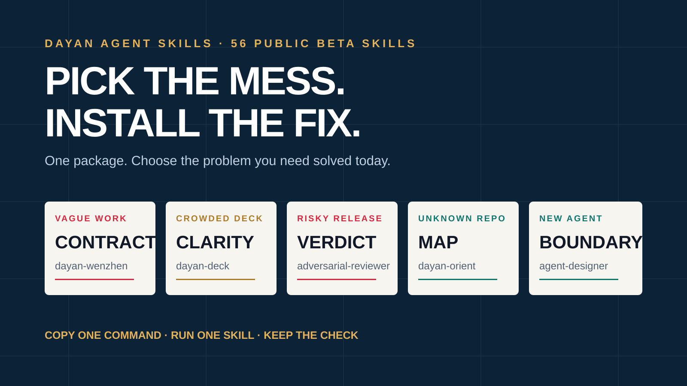

<p align="center">
  <picture>
    <source media="(prefers-color-scheme: dark)" srcset="assets/dayan-mark-on-dark.svg">
    <source media="(prefers-color-scheme: light)" srcset="assets/dayan-mark.svg">
    
  </picture>
</p>

<h1 align="center">DAYAN AGENT SKILLS</h1>

<p align="center"><strong>Give probabilistic AI a control layer.</strong></p>

<p align="center">
  Open skills, harnesses, hooks, and verifiers for making agent work more repeatable, inspectable, and human-friendly.
</p>

<p align="center">
  <a href="docs/quickstart.md"><strong>START IN 60 SECONDS</strong></a>
  ·
  <a href="https://kosmoray.github.io/dayan-agent-skills/">Live demos</a>
  ·
  <a href="README.zh-CN.md">中文</a>
  ·
  <a href="https://github.com/Kosmoray/dayan-agent-skills"><strong>★ STAR THIS CONTROL LAYER</strong></a>
</p>

<p align="center">
  <a href="https://kosmoray.github.io/dayan-agent-skills/">
    
  </a>
</p>

## The idea

Early AI feels like a manual film camera: powerful, but every focus, exposure, and timing decision is left to the operator.

Agent skills are the semi-automatic modes. A Skill chooses the workflow. A harness holds the process together. Hooks stop predictable mistakes. Verifiers check whether the result earned the claim.

This repository publishes those control layers instead of hiding them.

## 56 Skills. One control library.

The library now spans engineering quality, research and decisions, agent systems, content and design, and product architecture—without splitting stars, issues, or contributors across small repositories.

[Start in 60 seconds](docs/quickstart.md) · [Choose a Skill](docs/choose-a-skill.md) · [Read the playbooks](docs/playbooks/README.md) · [Browse all 56 Skills](docs/skills.md) · [Inspect evidence](catalog.json)

## Start here

Do not begin by reading 56 folders. Pick the route that matches the failure you want to stop:

| If the work fails because... | Start with | Why |
| --- | --- | --- |
| the task is vague or risky | [`dayan-wenzhen`](skills/dayan-wenzhen/SKILL.md) | creates a falsifiable task contract before polished output hides a wrong assumption |
| the artifact is hard to explain | [`dayan-deck`](skills/dayan-deck/SKILL.md) | gives each slide one job and verifies the deck structure |
| release review is too soft | [`dayan-adversarial-reviewer`](skills/dayan-adversarial-reviewer/SKILL.md) | checks failure modes, maintenance traps, and trust boundaries separately |
| the repository is unfamiliar | [`dayan-orient`](skills/dayan-orient/SKILL.md) | maps code before changes start |
| the agent itself is unclear | [`dayan-agent-designer`](skills/dayan-agent-designer/SKILL.md) | defines responsibilities, tools, memory, boundaries, and evaluation |

The fastest safe trial is a temporary-home install:

```bash
git clone https://github.com/Kosmoray/dayan-agent-skills.git
cd dayan-agent-skills
DAYAN_TEST_HOME="$(mktemp -d)"

python3 installers/install.py dayan-wenzhen \
  --agent codex \
  --home "$DAYAN_TEST_HOME"

python3 skills/dayan-wenzhen/scripts/verify_contract.py \
  skills/dayan-wenzhen/examples/starter-contract.json
```

Generate a paste-ready compatibility report:

```bash
python3 scripts/compatibility_smoke.py
```

Smoke the full library and write a compatibility matrix:

```bash
python3 scripts/compatibility_smoke.py \
  --all-skills \
  --json-output docs/compatibility-matrix.json
```

Run the offline lifecycle smoke:

```bash
python3 scripts/runtime_smoke.py
```

Smoke discovery, trigger routing, example commands, and safe update for the full library:

```bash
python3 scripts/runtime_smoke.py \
  --all-skills \
  --json-output docs/runtime-smoke.json
```

See the full [Quickstart](docs/quickstart.md), [Skill chooser](docs/choose-a-skill.md), [Compatibility evidence](docs/compatibility.md), and [FAQ](docs/faq.md).

## Copy-paste examples and fixtures

Try one sanitized run before integrating anything:

The repository now includes [11 sanitized example runs](examples/runs/README.md), including:

- [Wenzhen fuzzy request](examples/runs/wenzhen-fuzzy-request.md): turn a vague AI-support idea into a falsifiable task contract.
- [Deck from outline](examples/runs/deck-from-outline.md): turn a practical outline into a verifier-ready presentation request.
- [Adversarial review verdict](examples/runs/adversarial-review-verdict.md): turn a release description into a concrete BLOCK/CONCERNS/CLEAN review.
- [API pagination contract review](examples/runs/api-review-pagination-contract.md): block an unbounded endpoint before clients depend on it.
- [AI visibility for open-source docs](examples/runs/ai-seo-open-source-docs.md): make claims easier for AI assistants to cite accurately.

It also includes [5 artifact fixtures](docs/fixtures/README.md) that show copyable output shapes for repository orientation, agent design, guardrail hooks, API review, and AI visibility audits.

Then use the public [playbooks](docs/playbooks/README.md) to decide whether your repeated workflow should become a checklist, Skill, verifier, hook, or agent.

## Choose your route

| Create | Think | Build | Verify & Grow |
| --- | --- | --- | --- |
| [Deck](skills/dayan-deck/SKILL.md) | [Wenzhen](skills/dayan-wenzhen/SKILL.md) | [Agent Designer](skills/dayan-agent-designer/SKILL.md) | [Adversarial Reviewer](skills/dayan-adversarial-reviewer/SKILL.md) |
| [Huashu Design](skills/dayan-huashu-design/SKILL.md) | [Plan](skills/dayan-plan/SKILL.md) | [Agent Factory](skills/dayan-agent-factory/SKILL.md) | [AI SEO](skills/dayan-ai-seo/SKILL.md) |
| [HTML](skills/dayan-html/SKILL.md) | [Orient](skills/dayan-orient/SKILL.md) | [Hook Factory](skills/dayan-hook-factory/SKILL.md) |  |
| [Diagram](skills/dayan-diagram/SKILL.md) |  |  |  |

All 56 are installable public betas. Featured Skills have dedicated validators; the Core Library uses a shared strict public bundle contract, package-install matrix, and offline lifecycle smoke.

## Featured Skills

### `dayan-deck` · public beta

Turn a topic, outline, or source document into a self-contained HTML presentation with:

- one narrative job per slide;
- a locked visual and motion system;
- editable text instead of full-slide screenshots;
- keyboard, print, responsive, and reduced-motion behavior;
- a deterministic structural verifier;
- explicit limits for visual quality, factual accuracy, and PPTX export.

[Read the Skill](skills/dayan-deck/SKILL.md) · [Open the live starter](https://kosmoray.github.io/dayan-agent-skills/) · [Inspect the verifier](skills/dayan-deck/scripts/verify_deck.py)

### `dayan-adversarial-reviewer` · public beta

Review a concrete change before merge or release through three distinct lenses:

- failure modes: malformed, repeated, partial, concurrent, interrupted, and rollback paths;
- maintainability: hidden contracts, mixed responsibilities, and regression traps;
- trust boundaries: untrusted input, authorization, files, environment, logs, and secrets;
- evidence-backed `BLOCK`, `CONCERNS`, or `CLEAN` verdicts;
- matching human-readable Markdown and machine-verifiable JSON;
- accepted and blocking fixtures plus a deterministic verdict validator.

[Read the Skill](skills/dayan-adversarial-reviewer/SKILL.md) · [Inspect the rubric](skills/dayan-adversarial-reviewer/references/rubric.md) · [Run the validator](skills/dayan-adversarial-reviewer/scripts/verify_review.py)

### `dayan-wenzhen` · public beta

Turn a vague, risky, or solution-shaped request into a decision-ready task contract before the agent starts generating a polished answer:

- triage the work type, risk level, currently allowed action, release authority, and minimum evidence;
- state a falsifiable best-current problem hypothesis rather than pretending certainty;
- ask only questions whose answers can change the route;
- compare the current route, alternatives, a reframed third route, and a genuine defer-or-shrink option;
- end with the smallest reversible bet, pause signal, checkpoint, and evidence needed to continue;
- return human-readable Markdown plus a machine-verifiable JSON contract.

[Read the Skill](skills/dayan-wenzhen/SKILL.md) · [Inspect the schema](skills/dayan-wenzhen/references/contract-schema.md) · [Run the validator](skills/dayan-wenzhen/scripts/verify_contract.py)

## Install in under a minute

Clone the repository, then install into an explicit agent home. Use a temporary home for first inspection:

```bash
git clone https://github.com/Kosmoray/dayan-agent-skills.git
cd dayan-agent-skills
DAYAN_TEST_HOME="$(mktemp -d)"

python3 installers/install.py dayan-deck \
  --agent codex \
  --home "$DAYAN_TEST_HOME"
```

Replace `dayan-deck` with any name in the route table to install another public beta Skill.

Claude Code packaging target:

```bash
python3 installers/install.py dayan-deck \
  --agent claude-code \
  --home "$DAYAN_TEST_HOME"
```

The beta installer performs new installs only and refuses to overwrite an existing Skill directory. See the [installation contract](docs/install.md).

## Try the verifier

```bash
python3 skills/dayan-deck/scripts/verify_deck.py \
  skills/dayan-deck/examples/starter.html

python3 skills/dayan-adversarial-reviewer/scripts/verify_review.py \
  skills/dayan-adversarial-reviewer/examples/block-review.json

python3 skills/dayan-wenzhen/scripts/verify_contract.py \
  skills/dayan-wenzhen/examples/starter-contract.json
```

Expected result:

```text
PASS: ...starter.html satisfies the structural deck contract (4 slides)
```

The verifier deliberately rejects remote runtime dependencies, multiple active slides, missing slide headings, credential-like assignments, private paths, and presenter notes inside audience-facing HTML.

## Verify any new bundle

```bash
python3 scripts/validate_public_skill.py dayan-orient

python3 scripts/verify_fixtures.py
```

See [`catalog.json`](catalog.json) for readiness evidence and unresolved host-version evidence for every Skill.

## Design principles

1. **Result before ritual.** A Skill must create a useful artifact, not merely describe a philosophy.
2. **Evidence before claims.** A passing test proves only what the test actually checks.
3. **Open by default.** General AI control and verification mechanisms should earn public names, citations, and improvements.
4. **Human authority stays explicit.** Publication, spending, credentials, consequential decisions, and high-stakes claims retain human control.
5. **Failure is part of the product.** Rejected fixtures and stop conditions matter as much as happy paths.

## Compatibility

The repository verifies packaging into Codex and Claude Code Skill directories in isolated temporary homes, then runs an offline lifecycle smoke that discovers installed Skills, routes catalog trigger text, executes declared example commands, and tests marker-guarded update. That is still not a claim that every product version loads the Skill UI or that every model routes identically.

See [`docs/compatibility.md`](docs/compatibility.md) and [`docs/runtime-smoke.md`](docs/runtime-smoke.md).

## Contributing

Issues and pull requests are welcome. A useful contribution includes:

- one repeatable user problem;
- a clear trigger and non-trigger boundary;
- one accepted fixture;
- one rejected or unsafe fixture;
- a validator or an explicit human-review contract;
- license provenance.

Start with [`CONTRIBUTING.md`](CONTRIBUTING.md) or propose a Skill using the issue template.

## Security and provenance

The public beta is a clean-room package. It excludes customer material, private templates, internal infrastructure, machine-specific paths, credentials, and third-party binary assets. Read [`SANITIZATION.md`](SANITIZATION.md), [`SECURITY.md`](SECURITY.md), and each Skill's local provenance and sanitization record.

## License

[MIT](LICENSE).

---

Built by Dayan for people who want AI to feel **controllable—not magical**.
